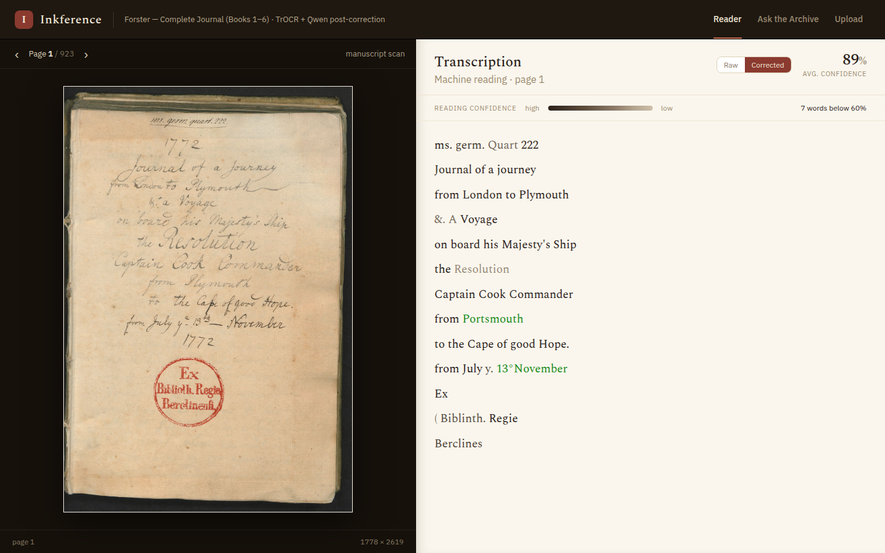
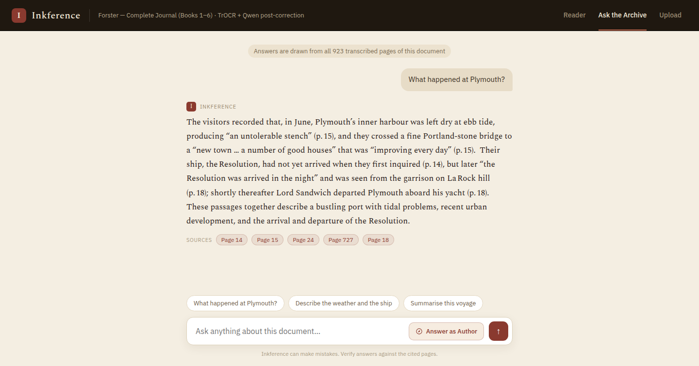
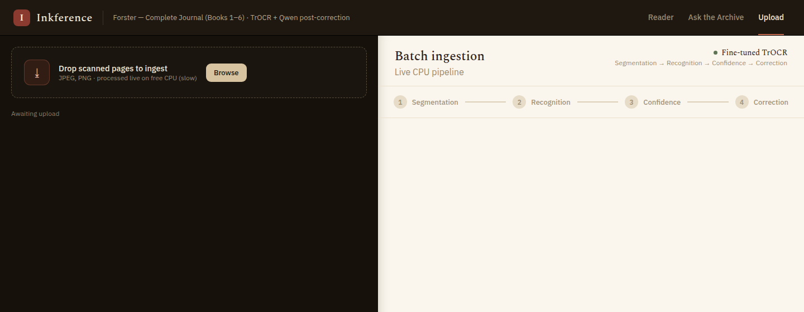

# Inkference

**Inkference** turns handwritten manuscripts into a searchable, question-answerable
archive. It was built on the six-book manuscript journal of **Johann Reinhold Forster**,
the naturalist on Captain Cook's second voyage (1772–1775) — ~923 pages of 18th-century
handwriting — but the pipeline works on any handwritten scans.

It combines **HTR** (handwritten text recognition) with **RAG** (retrieval-augmented
generation): every page is segmented, transcribed, confidence-scored, LLM-proofread, and
indexed so you can read it side-by-side with the scan or just *ask the archive* a question.

### ▶ [Try the live demo on Hugging Face](https://huggingface.co/spaces/sajitkun125/inkference-app)

*Free-tier CPU Space — it sleeps when idle, so the first load can take a minute to wake.*

## The three views

| View | What it does |
|---|---|
| **Reader** | Scan next to its transcription; per-word **confidence tinting**, page-average %, and a Raw ⟷ Corrected toggle (green = LLM edits). Page navigation is cyclic. |
| **Ask the Archive** | Ask a natural-language question; get a grounded answer with **source-page citations**, or an in-character **"Answer as Author"** (Forster) response. |
| **Upload** | Drop new scans → live pipeline (**Segmentation → Recognition → Confidence → Correction**) with line-box overlays and a progress stepper. |

### Reader

The scan on the left, the machine transcription on the right. Ink darkness encodes
per-word model confidence, green words are LLM proofreading edits, and the header shows
the page average plus how many words fell below 60%.



### Ask the Archive

A grounded answer with clickable source-page chips — each one jumps the Reader to that page.



### Upload

Drag in scans and watch the four-stage pipeline run live, with segmentation boxes drawn
over the page as they are found.



## How it works

- **Segmentation** — Kraken `blla` baseline segmentation into line polygons.
- **Recognition** — fine-tuned **TrOCR** (base, Bentham-trained) with **per-word confidence**.
- **Post-correction** — page-level, few-shot LLM proofreading (Qwen via Groq) that fixes OCR
  errors while preserving archaic spelling; corrected words keep their confidence tint.
- **RAG** — `all-MiniLM-L6-v2` embeddings + **FAISS** retrieval → grounded answer from a
  free-tier LLM (Groq `gpt-oss-120b` → Gemini fallback → extractive), with page citations.
- **Agent** — an optional **LangGraph** research loop for questions plain RAG can't serve.
- **Serving** — **FastAPI** backend + static frontend; **SQLite** store; background ingest jobs.

## Ask the Archive: two modes

**Fast path — `POST /api/documents/{id}/ask`** (the default). One dense top-k lookup, one
LLM call, ~2 s. Right for factoid questions.

**Deep research — `POST /api/documents/{id}/agent`.** A LangGraph agent for the two things
the fast path structurally cannot do:

- **Narrative questions.** The journal is a *diary*. *"What happened in the days after they
  reached Plymouth?"* needs consecutive pages read in order; five scattered 600-char chunks
  cannot answer it. The agent searches to locate the topic, then reads page **ranges**.
- **Follow-ups.** `/ask` is stateless, so *"and what was the weather like there?"* has no
  referent. The agent keeps per-thread conversation memory and rewrites the question to
  stand on its own before retrieving.

```
prepare → plan ─┬─(tool)→ act ─┬─(budget left)→ plan
                │              └─(spent)──────→ compose → END
                └─(answer)────────────────────→ compose → END
```

Tools (`agent/corpus.py`, all backed by existing store/index methods): `search`,
`read_page`, `read_range`, `overview`.

Two design decisions worth knowing:

1. **`rag/llm.py` is still the only model layer.** LangGraph does orchestration only — no
   langchain chat models, no provider SDKs — so the Groq → Gemini → extractive fallback
   chain keeps working inside the agent.
2. **Tools are called via a JSON text protocol, not provider-native tool calling.** The
   fallback chain switches provider *per call*, and a native tool transcript is a
   provider-specific object graph (OpenAI `tool_calls` vs Gemini `functionCall` vs Anthropic
   `tool_use`). With a text protocol the transcript is just a string, so any provider can
   resume the run at any step. `agent/protocol.py` carries the tolerant parser this requires.

With **no API key at all** the agent degrades to a single deterministic retrieval plus the
extractive fallback — exactly what `/ask` does — rather than erroring.

```bash
# narrative
curl -s localhost:8000/api/documents/1/agent -H 'content-type: application/json' \
  -d '{"question":"What happened in the days after they reached Plymouth?","thread_id":"t1"}'
# follow-up on the same thread — "there" resolves to Plymouth
curl -s localhost:8000/api/documents/1/agent -H 'content-type: application/json' \
  -d '{"question":"And what was the weather like there?","thread_id":"t1"}'
# forget a conversation
curl -s -X DELETE localhost:8000/api/documents/1/agent/threads/t1
```

Budgets (all env-overridable, see `AgentConfig` in `config.py`): `AGENT_MAX_STEPS=4`,
`AGENT_TIME_BUDGET_S=45`, `AGENT_LLM_TIMEOUT_S=30`, `AGENT_EVIDENCE_CHARS=9000`. A typical
run is 2 LLM calls, a narrative one 3–4, worst case 7. `AGENT_ENABLED=false` turns the
endpoints off and hides the UI toggle.

Conversation memory is a LangGraph SQLite checkpointer at
`{INKFERENCE_DATA_ROOT}/agent_checkpoints.db` — deliberately **not** inside `inkference.db`,
which the deploy script copies into the *public* HF seed dataset. On the free Space `/data`
is ephemeral, so memory lasts until the Space sleeps.

> The screenshots above are from the deployed Space, which currently runs the fast path
> only. Deep research is available when you run locally, and on the Space after the next
> deploy.

## Repository layout

The application lives in [`app/`](app/); the original HTR research (notebooks, data, models)
remains at the repo root, untouched.

```
├── app/                             the Inkference platform
│   ├── pyproject.toml               installable package metadata
│   ├── src/inkference/
│   │   ├── config.py                env-driven config + path layout
│   │   ├── schemas.py               domain types (Word / Line / PageResult, enums)
│   │   ├── htr/                     segmentation → recognition (+confidence) → pipeline
│   │   ├── rag/                     chunk + embed + FAISS retrieval + grounded answers
│   │   ├── agent/                   LangGraph research agent over the corpus
│   │   ├── store/                   SQLite store + seed loaders
│   │   └── api/                     FastAPI app + background ingestion jobs
│   ├── frontend/                    UI (index.html / styles.css / app.js — no build step)
│   ├── scripts/                     prepare_model.py (assemble inference model)
│   ├── tests/                       offline unit tests (no model loads, no network)
│   └── deploy/                      Dockerfile + Space README + lean CPU requirements
├── notebooks/                       HTR research (see below)
├── data/ · models/ · transcriptions/   research corpora, checkpoints, line crops
└── images/                          screenshots and workflow docs
```

## Run the app locally

```bash
# 1. Environment
python -m venv .venv && source .venv/bin/activate
pip install --upgrade pip
pip install -r requirements.txt && pip install -e ./app

# 2. Start the server (reads app/.env for data root, model, and API keys)
uvicorn inkference.api.main:app --port 8000

# 3. Open http://127.0.0.1:8000
```

The seeded corpus (DB + FAISS index) loads on startup; page scans resolve from
`INKFERENCE_IMAGES_ROOT`. `app/deploy/README.md` has the full environment-variable reference.

Starting from an empty data root instead:

```bash
INKFERENCE_DATA_ROOT=$(pwd)/app/.inkference_data_fresh \
  uvicorn inkference.api.main:app --port 8000 --log-level debug
```

### Using it

1. **Reader** — flip through pages; toggle Raw/Corrected; hover low-confidence words to see scores.
2. **Ask the Archive** — type a question (e.g. *"What did Forster note about the weather?"*);
   answers cite the pages they came from. Try **Answer as Author** for an in-character reply,
   or **Deep research** for narrative questions and follow-ups.
3. **Upload** — drag in a scan; watch the four-stage pipeline; the new page joins the Reader
   and the search index automatically. (On free CPU, a page takes a few minutes.)

## Tests

```bash
cd app && ../.venv/bin/python -m pytest tests -q
```

Offline by design — no model loads and no provider calls, so the suite runs in ~2 s. Covers
the agent's action parser (the highest-risk component), the corpus tools against a fixture
store, graph control flow with a scripted planner, and the `rag/llm.py` fallback behaviour.

## Rebuild the seed corpus (all 6 books, with post-correction)

Rebuilds the local DB + FAISS index that the Space deploy ships. The seeder reads from
`~/Downloads/AlexFiles`:

- `moredata/confidence/B<N>_P<NNN>.txt` — raw TrOCR words + per-word confidence
- `moredata/corrected_transcriptions/B<N>_P<NNN>.txt` — post-corrected text (for `--with-correction`)

Page images are **not** copied — the DB stores relative keys (`book<N>/forster<N>/…jpg`)
resolved at serve time against `INKFERENCE_IMAGES_ROOT`.

```bash
# Stop any running server first (the DB is locked while it's up).
# 1. Wipe the old corpus — the seeder skips ("already seeded") if the doc still exists.
rm -f  app/.inkference_data_all_books_corrected/inkference.db \
       app/.inkference_data_all_books_corrected/inkference.db-shm \
       app/.inkference_data_all_books_corrected/inkference.db-wal
rm -rf app/.inkference_data_all_books_corrected/index

# 2. Re-seed all 6 books WITH post-correction (~923 pages; a few minutes).
INKFERENCE_DATA_ROOT=$(pwd)/app/.inkference_data_all_books_corrected \
  .venv/bin/python -m inkference.store.seed_all_books --alex ~/Downloads/AlexFiles --with-correction
```

Drop `--with-correction` for the raw-only corpus (slug `all-books-without-post-correction`).
Any live-uploaded pages in that data root are discarded by the rebuild (they only ever lived
in the DB). After rebuilding, redeploy to push the new DB + index.

## Deploy to a Hugging Face Space (full corpus, all 6 books)

Everything large lives in a **public HF dataset** (HF's Docker build ships Git-LFS as
pointers, so large/binary files can't go in the Space repo). The image pulls them at build
with `snapshot_download`:

- **scans (1.3 GB)** → streamed from the dataset CDN (not baked)
- **prebuilt DB + FAISS index (~40 MB)** → downloaded at build → instant boot, no re-seed

**1. Upload the scans once (public dataset):**

```bash
hf auth whoami                                          # ensure logged in (else: hf auth login)
hf repo create inkference-book-images --repo-type dataset
hf upload sajitkun125/inkference-book-images ~/Downloads/AlexFiles . \
  --repo-type dataset --include "book*/forster*/*.jpg"
```

**2. Deploy** — uploads the prebuilt DB + index to the dataset (`seed_data/`) and the app
code to the Space:

```bash
bash app/deploy/deploy_all_books.sh sajitkun125/inkference-app
```

Step by step, this:

1. **Checkpoints the SQLite WAL** into `inkference.db` so the uploaded DB is self-contained.
2. **Uploads DB + FAISS index** to the dataset under `seed_data/` (the ~923-page corpus).
3. **Uploads the app code** (Dockerfile, `src/`, `frontend/`, requirements) to the Space,
   `--delete`-ing stale files. This push triggers an automatic Space rebuild, during which
   the image `snapshot_download`s the fresh `seed_data/` and copies it into `/data` on boot.

The script **aborts before uploading** if the DB contains any live-uploaded pages (rows with
an absolute `image_path`). Uploaded pages save a machine-local path (`/data/assets/…`) that
doesn't exist on the Space, so shipping them would render broken scans — rebuild the seed
cleanly (above, server stopped) if you hit this.

**3. On the Space → Settings → Variables and secrets** (only needed once; these persist):

- Variable `INKFERENCE_IMAGES_BASE_URL` =
  `https://huggingface.co/datasets/sajitkun125/inkference-book-images/resolve/main`
- Secrets `GROQ_API_KEY`, `GEMINI_API_KEY`

**4. Factory reboot the Space** (Settings → "Factory reboot"). **Required to serve a fresh
corpus and drop pages uploaded on the Space.** `/data` is ephemeral but the boot copy uses
`cp -rn` (no-clobber), so it won't overwrite an existing `/data/inkference.db`. A Factory
reboot wipes `/data` and bypasses the cached build layer, so the container starts empty and
loads *only* the fresh 923-page seed. (A plain restart keeps whatever is already in `/data`.)

The Dockerfile's `SEED_DATASET` must match your dataset (default
`sajitkun125/inkference-book-images`).

**Alternative: Book-1-only demo** (self-contained, base64 images):

```bash
bash app/deploy/deploy_to_hf.sh sajitkun125/inkference-app
```

## Research notebooks

[`notebooks/`](notebooks/) holds the research that produced the segmentation settings and the
fine-tuned recognizer the app uses. Suggested reading order (it mirrors the pipeline):

1. **Segment** — [`segmentManualTranscriptionsIntoLinesWithKraken.ipynb`](notebooks/segmentManualTranscriptionsIntoLinesWithKraken.ipynb)
   → cut manuscript pages into line images with Kraken.
2. **Organize & label** — [`organizeLinesIntoFinalTranscriptionFolders.ipynb`](notebooks/organizeLinesIntoFinalTranscriptionFolders.ipynb),
   [`writeGroundTruthForB6P060.ipynb`](notebooks/writeGroundTruthForB6P060.ipynb),
   [`visualizeFinalTranscriptionLinesAndGT.ipynb`](notebooks/visualizeFinalTranscriptionLinesAndGT.ipynb)
   → build line/ground-truth pairs and eyeball them.
3. **EDA & modeling** — [`edaAndModelingOcrVersionForGPU.ipynb`](notebooks/edaAndModelingOcrVersionForGPU.ipynb)
   → the core TrOCR training/inference loop.
4. **Cross-dataset training** — `cross_validation*.ipynb`, `downloadBullingerTrainAndTestData.ipynb`,
   `fineTuneTrOcrCheckPointWithReadOrGermanDataSet*.ipynb`, `furtherfinetuningTrOcrWithBulliger*.ipynb`,
   `zeroShotEvalReadCheckpointOnBullingerGerman.ipynb`
   → pre-train/evaluate on public HTR corpora (Bentham, Bullinger, READ/German, Washington).
5. **Target-domain fine-tuning** — [`notebooks/captainCookManualTranscriptsNotebooks/`](notebooks/captainCookManualTranscriptsNotebooks/):
   `zeroShotTrocrBaseUsingGoogleColab` (baseline) → `finetuneTrocrBase`/`finetuneTrocrLarge`/
   `finetuneBenthamCheckpoint` (the winning lineage → `models/trocr_best_from_bentham`) →
   [`compareExperimentResults.ipynb`](notebooks/captainCookManualTranscriptsNotebooks/compareExperimentResults.ipynb)
   → CER/WER comparison that picked the production checkpoint.

**Navigating them:** notebooks ending in `…FromGoogleColabDrive` / `…FromDrive` / `…UsingGoogleColab`
are the **GPU (Google Colab)** versions — open them in Colab with the datasets mounted from Drive;
the plain-named ones run locally. Training notebooks expect the public HTR datasets and a GPU;
the segmentation/organization/visualization notebooks run on CPU against
[`transcriptions/`](transcriptions/) and [`data/`](data/). The extracted, importable version of
this logic lives in [`app/src/inkference/htr/`](app/src/inkference/htr/).

## Tech stack

Python · FastAPI · PyTorch · Transformers (TrOCR) · Kraken · sentence-transformers · FAISS ·
LangGraph · SQLite · Groq / Gemini APIs · vanilla HTML/CSS/JS · Docker (Hugging Face Space).
